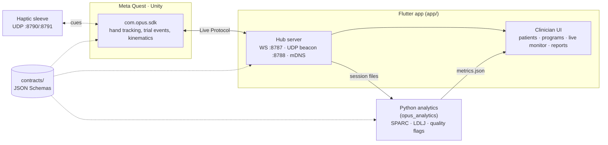

# Chetna — VR Neurorehabilitation Platform

**Chetna** (चेतना, *awareness*) is a contracts-first VR upper-limb neurorehabilitation platform: a
Meta Quest hand-tracking game, a Flutter clinician app, and a Python kinematic-analytics pipeline.

Start here → [CONTEXT.md](CONTEXT.md) (living state) · [GOAL.md](GOAL.md) · [docs/ARCHITECTURE.md](docs/ARCHITECTURE.md) · [docs/PLAN.md](docs/PLAN.md)

## Architecture



The Flutter app *is* the hub — there's no separate backend yet (see `backend/` below). The JSON
Schemas in `contracts/` are the only coupling between the three pieces.

## Folders

| Folder | What |
|---|---|
| `contracts/` | JSON Schemas shared by every component + fixtures + validator |
| `game/` | Unity 6 Quest app: `com.opus.sdk` + shell + games (Orchard Reach first) |
| `app/` | Flutter clinician app — also runs the hub (WS/UDP server) |
| `analytics/` | Python `opus_analytics`: kinematic biomarkers |
| `sim/` | Synthetic patient generator + fake hub/headset test harness |
| `backend/` | Not yet built — planned FastAPI + Postgres bridge |
| `docs/` | Design docs, agent briefs |
| `logs/` | CHANGELOG + per-session logs |

## Getting started

```bash
# Unity: open game/ in Unity 6000.4.6f1 (URP, Meta XR Core/Interaction SDK, XR Hands)

# Flutter app
cd app && flutter pub get && flutter run -d chrome

# Analytics
cd analytics && pip install -r requirements.txt && python -m pytest -q
```

## The name

**Chetna** is the product name; **OPUS** was the build codename and still lives on inside
identifiers that are risky to rename: `com.opus.sdk`, `opus_analytics`, `opus_app`, `OpusTokens`,
the `_opus-hub._tcp` mDNS service, `/opus/v1/...` URLs. New prose should say Chetna; code/protocol
identifiers stay as-is. History: this repo (and its forks) moved from `black1plague2/opus-rehab`
to `black1plague2/chetna` — old URLs redirect.

## References

- [GOAL.md](GOAL.md) — success criteria
- [CONTEXT.md](CONTEXT.md) — living state, current session, agent rules
- [docs/CONTRIBUTING.md](docs/CONTRIBUTING.md) — contracts-first ground rules
- [docs/ARCHITECTURE.md](docs/ARCHITECTURE.md) — module + data-flow detail
- [analytics/VALIDATION.md](analytics/VALIDATION.md) — metrics, quality gates, synthetic ground truth
- [CREDITS.md](CREDITS.md) — third-party assets and their licences (rigged hand: Elena FF, CC BY-SA 4.0)

---
*Contracts-first: `contracts/schemas/` is the only coupling between the game, the app, and
analytics. Keep `contracts/validate.py` green.*
