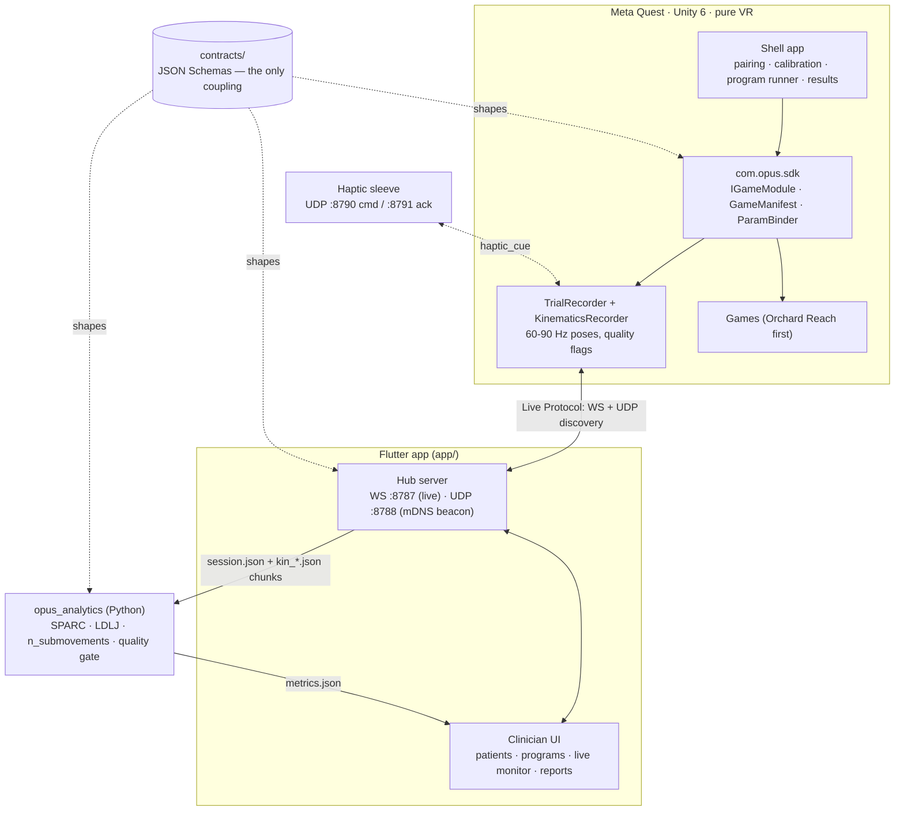

# Architecture

## System overview

**No backend exists yet.** The Flutter app plays the hub role directly (WebSocket + UDP server,
mDNS advertisement); `backend/` (FastAPI + Postgres) is a planned Phase 3, not built. Sessions are
plain files on disk (`session.json`, `kin_*.json`, `events.ndjson`) that `opus_analytics` reads
straight off the hub's sessions directory.

## Contracts-first plug-in games

Everything is keyed off `contracts/` (versioned JSON Schema) — the only shared dependency between
the three components.

| Contract | Purpose |
|---|---|
| `game-manifest.schema.json` | A game's id, version, param schema (+ UI hints), events, metric ids — the app renders prescription forms from this |
| `program.schema.json` | Clinician program: schedule + ordered blocks `{gameId, params, durationSec, reps}` |
| `session-envelope.schema.json` | Session metadata: device, versions, calibration, timing |
| `event.schema.json` | Trial events (`trial_start`, `target_shown`, `contact`, `trial_end`, …) with monotonic `t_ms` |
| `kinematics-chunk.schema.json` | Columnar pose frames (head/wrist/finger, pos+rot+confidence), seq-numbered |
| `live-message.schema.json` | Live channel: status, current trial, rolling metrics, commands |
| `metrics.schema.json` | Per-trial + per-session metric values with unit, method version, quality flag |
| `haptic-*.schema.json` | Haptic sleeve device/cue commands and acks |

Adding a game = a new folder under `game/Assets/Games/<Id>/` (scene + `manifest.json` + an
`IGameModule`), discovered via a generated registry. No core edits.

## Component notes

- **game/** — Unity 6, ISDK `IHand` (pre-filter), hand-tracking frequency kept **Low** (Fast Motion
  Mode is an off-by-default A/B flag). `KinematicsRecorder` ring-buffers joints + HMD, flushes
  chunks to disk; resumable outbox.
- **app/** — Flutter, Riverpod + go_router. Dynamic prescription forms driven entirely by a game's
  `paramSchema`; no per-game widgets. The hub (`core/hub/`) speaks the Live Protocol and writes
  uploaded session files to disk.
- **analytics/** — `opus_analytics` computes SPARC, LDLJ, n_submovements, path-length ratio,
  endpoint error, trunk lean, neglect index, fatigue slope. Every metric carries `quality`
  (`ok`/`degraded`/`invalid`); `degraded` when `rate_hz < 45` or tracking loss exceeds
  `analytics/VALIDATION.md`'s threshold. Target: <5% error vs. synthetic ground truth.
- **sim/** — synthetic patient generator (`sim/synthetic_patients`) plus `fake_hub`/`fake_headset`
  for the Live Protocol, used by both CI and the Flutter mock repositories.

## Networking

- Discovery: mDNS (`_opus-hub._tcp`) + UDP beacon fallback, no QR pairing yet.
- Live: WebSocket, JSON, low-rate (status/commands/rolling metrics only — no kinematics on this
  channel). Commands are acked.
- Bulk: session files uploaded to the hub in chunks, idempotent by `(session_id, seq)`.
- Haptics: separate UDP port pair, device discovery + cue/ack, capped intensity.

## Versioning

Semver per component (`sdk-vX`, `game-orchard-vX`, `app-vX`, `analytics-vX`, `contracts-vX`).
`releases/VERSIONS.md` records every **tested** build with commit + evidence.
